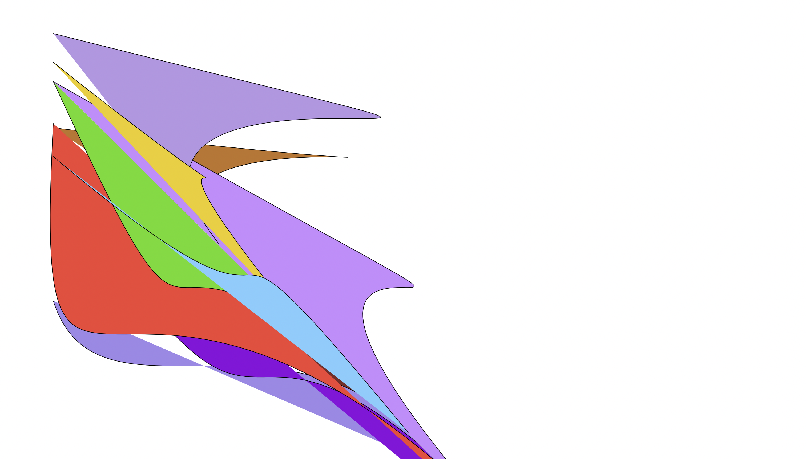
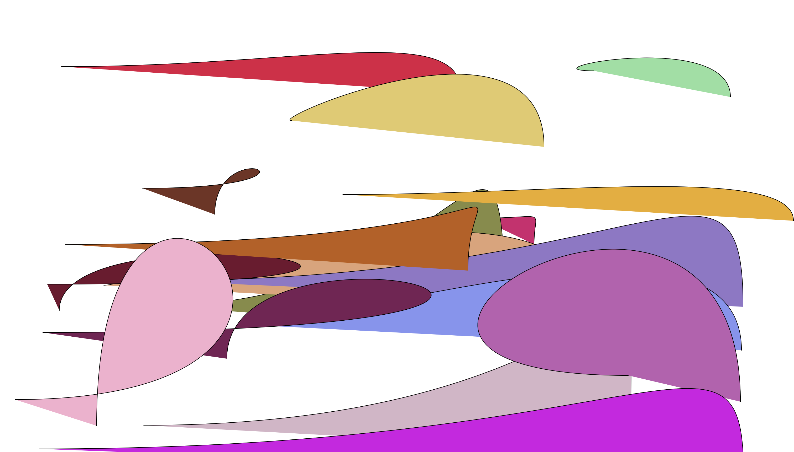
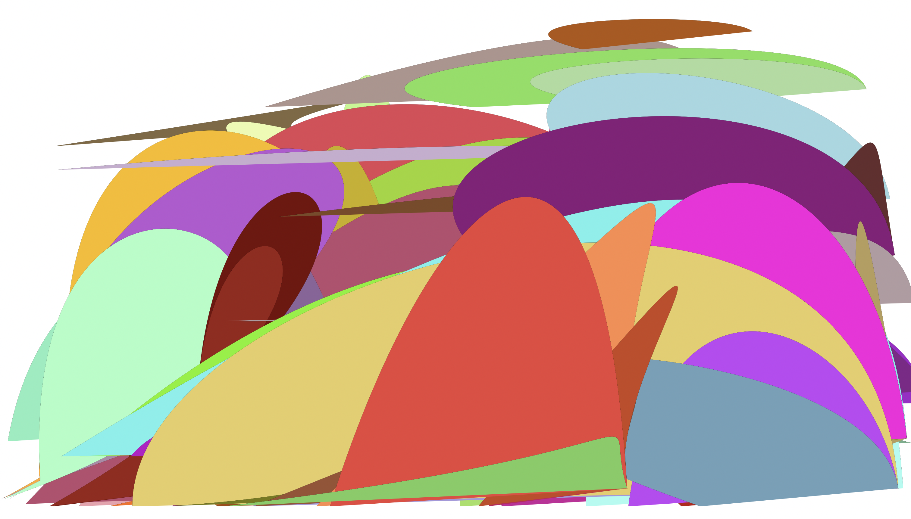

# Thinking
I want to draw a slpe here. Seems like fun.
So I began with exploring mouse X, mouse Clicked function and the bezier function. 

# Adjustments
I do think it is fun enough, but I want to further explore the aesthetics here.   

Then, I adjusted colors to make the created scene softner.  

Also, I played with the parameters of the slopes. It is fun to create small hills.   

